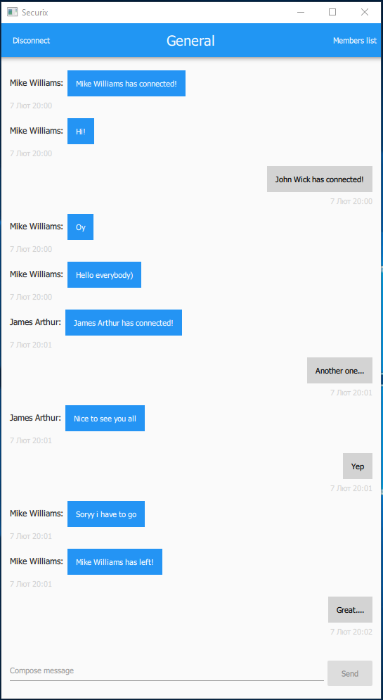
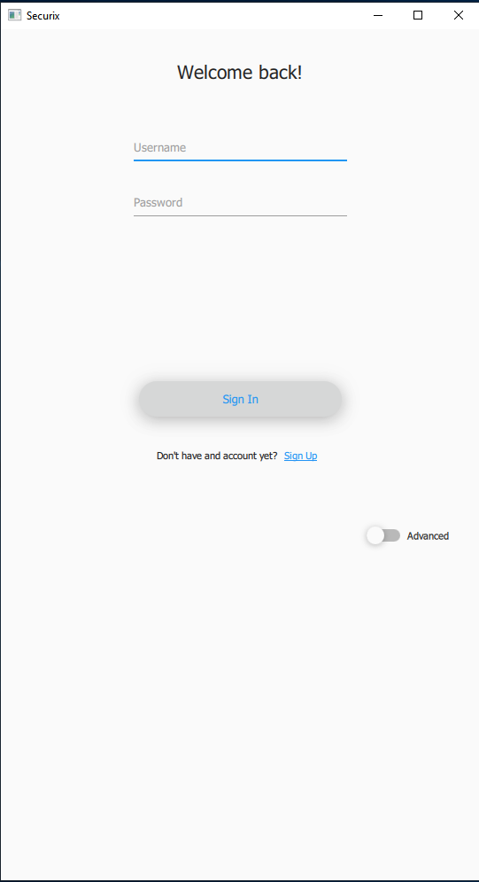
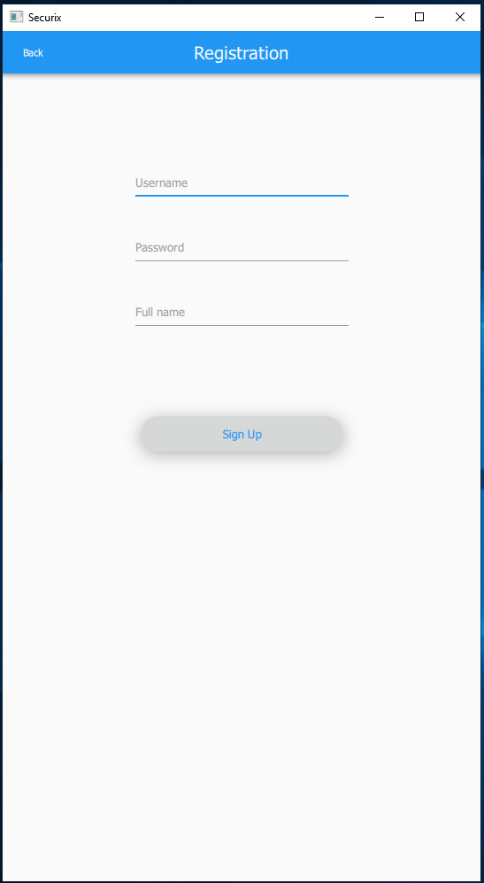

# GL C BaseCamp Task 2 (Secure Chat)

Application will:
- Consist of server and client parts.
- In one chat room more than two users can communicate.
- Client applications should have non-blocking GUI.
- Controls for displaying messages and their authors.
- Show notifications when users joined or left chat room.
- All communication should be secured.
- Compile for Linux and Windows.
- Non-blocking UI – it should not freeze while using the app.
- Documentation: requirements specification, software design documentation (application modules description, UML diagrams).

# How it looks now:

# Next things to do:
- Make better ui
- Add threading
- Disconnect ability for user